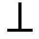
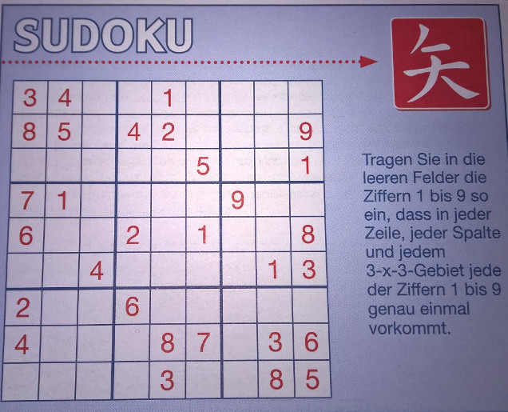

- title : Programmieren mit FUN
- description : Slides für die Spartakiade 2015
- author : Carsten König
- theme : beige
- transition : default

***

## Spartakiade

### Grundlagen der funktionalen Programmierung in F#

Carsten König

***

### Was ist überhaupt eine *funktionale* Sprache?

---

### Panik ...

- **Monaden**
- *Funktoren*
- Catamorphismen
- ...

---

### erinnert mich an

**klingt gefährlich ist aber nur Zucker**

---

### eigentlich geht es nur um

**reine** Funktionen

    let f n = n+n

und **unveränderliche** Datenstrukturen

    type 'a List =
        | []
        | (::) : 'a -> 'a List -> 'a List

---

## aber...

---

> Nun sag, wie hast du's mit den *Typen*?

*static* VS *dynamic*

[mehr Infos](https://en.wikipedia.org/wiki/Type_system)

---

*strict* VS *non-strict*

[mehr Infos](https://en.wikipedia.org/wiki/Evaluation_strategy)

---

Vielleicht sogar **total**?

*strong* VS *weak* functional Programming

[mehr Infos](https://en.wikipedia.org/wiki/Total_functional_programming)

---

### Heute:

Grundlagen in F#

- statisches Typsystem
- non-strict (*lazy* wird aber unterstützt)
- ganz sicher nicht *total*

***

## Der Plan

---

- Einführung in FP und F#
- Viele kleine Übungen
- Vorstellung Sudoku-Projekt
- Fragen, nach Wunsch, Feierabend

***

## Tools

***

## Grundlagen

---

## Übung

Sind folgende Funktionen gleich?

`let f a b c = a + b + c`

und

`let g a = fun b c -> a + b + c`

---

## Übung

Implementiere **FizzBuzz**

Siehe `Uebungen/FizzBuzz.fsx`

---

## Übung

Suche Beispiele für

- `bool * unit * char`
- `string * (int * int) * bool`

Schreibe Funktionen

- `first : 'a * 'b -> 'a`
- `second : 'a * 'b -> 'b`
- `curry : ('a*'b -> 'c) -> ('a -> 'b -> 'c)`
- `uncurry`

---

## Übung

Schreibe Funktionen

- `head : 'a list -> 'a`
- `tail : 'a list -> 'a list`
- `third` : soll das 3. Element einer Liste liefert
- Implementiere Dein eigenes *concat*

---

## Übung

Implementiere **Coin Change **

Für eine durch ihren Wert gegebene Liste von Münzen und einen bestimmten Betrag soll
eine Liste von möglichst wenigen Münzen berechnet werden, die den Betrag ergeben.

Siehe `Uebungen/CoinChange.fsx`

---

## Übung

- gib einen Typ an, der entweder ein `int*int` Tupel oder nichts enthält
- schreibe eine Funktion `eval : Expr -> int`

Wobei

	type Expr =
		| Zahl of int
		| Plus of Expr * Expr

---

## Übung

Wir *lösen quadratische Gleichungen*

Siehe `Uebungen/Mitternacht.fsx`

***

## Listen falten

---

## Übung

Implementiere eine Funktion `produkt` die das Produkt einer `int list` berechnet.

---

## Übung

Implementiere die Funktion `filter`:

gegeben: Prädikat `p : 'a -> bool` und `ls : 'a list`
gesucht: `'a list` mit Elementen `l` aus `ls` mit `p l = true`

---

## foldr

`foldR : ('a -> 's -> 's) -> 's -> 'a list -> 's`

---

## Übung

Implementiere jeweils mit `foldR`:

- `and : bool list -> bool`
- `or : bool list -> bool`
- `any : ('a -> bool) -> 'a list -> bool`
- `all : ('a -> bool) -> 'a list -> bool`

---

## foldl

`foldL : ('s -> 'b -> 's) -> 'a -> 'b list -> 'a`

---

## harte Übung

> Definiere `foldL` durch `foldR` (ohne direkte Rekursion)

***

## Sequenzen, Rekursion und Kombinatorik

---

## Übung

Implementiere eine Funktion

`crossProd : ('a list) list -> 'a list seq`

mit

- `[[1;2];[3];[4;5]] -> { [1;3;4]; [1;3;5]; [2;3;4]; [2;4;5] }`
- `[[1;2];[];[4;5]]  -> { }`

---

## Übung

Implementiere eine Funktion

`permutationen : 'a list -> 'a list seq`

---

## Übung

Implementiere `zip : 'a list -> 'b list -> ('a*'b) list` mit `Seq.unfold`

Beispiel: `zip [1;2;3] ['x'; 'y'] = seq [(1,'x'), (2,'y')]`

---

## Übung

**Pascals Dreieck**

Siehe `Uebungen/Pascal.fsx`

***

## Sudoku

